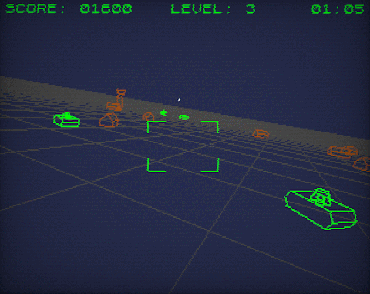

# SkyPatrol

Entry for LibGDX game jame #37 (June 2026)

Theme: 8 bit game (one life only).

This started as a test of pixel perfect upsizing a low resolution screen for a retro theme.

The idea is to render to a low resolution FBO (e.g. 320x240) and then render that full-screen.
Then add some vignette and a CRT shader. 
(For context, ZX Spectrum screen resolution was 256x192).

Added loading of GLTF models and converting the model to a wireframe model.

In the conversion we remove lines segments that appear multiple times to hide internal seams.
E.g. a quad is shows with four lines, not as two triangles because the diagonal line appears twice.
This simplifies the wire frame and makes the visuals easier to "read".

We add normals per vertex to hide lines belonging to back faces. There is some logic
in the fragment shader to hide lines of back faces. 
(We cannot use OpenGL back face culling because it doesn't apply to GL_LINES).
The wire frame shader does exactly that. It uses the normal vector per vertex, transforms it
to world space.  In the fragment shader we take the dot product of the normal vector
and the view vector and discard any that are back facing (dot product less than zero).

Playing with one life only can be quite brutal because sometimes the bad guys get a lucky shot.
But we had to have it because it was the theme.
Press 8 in the game to use a health percentage instead (20% damage per hit, restored at each level).
If you use this mode, your score in the hi score table won't appear with the "one life only" asterisk.
(revealing you to all who play this single player game as a cheater).

Play it here:
    https://monstrous-software.itch.io/sky-patrol

Music: 
    "Game" by Elija_K via Free Music Archive (CC BY)

Font:
    The font file in this archive was created using Fontstruct the free, online
    font-building tool.
    This font was created by “Mark sensen”.
    This font has a homepage where this archive and other versions may be found:
    https://fontstruct.com/fontstructions/show/1662490

## Platforms

- `core`: Main module with the application logic shared by all platforms.
- `lwjgl3`: Primary desktop platform using LWJGL3; was called 'desktop' in older docs.
- `teavm`: Web backend that supports most JVM languages.

## Post game jam

I was wondering if an ECS type approach would be a good fit for this game.  It is really not necessary as the game is
very simple, but it bugs me a little to have game object type specific code in World.

To compare performance I added a Frame Rate gadget to show FPS in-game.
It is activated with key 9.

For reference, you can change the start level in GameScreen.show().  This will increase the number of enemies (tanks and jets).
You also have to set the boolean `invincible` to true for testing to avoid getting killed.

| level | frame rate (fps) | using ECS approach |
|-------|------------------|--------------------|
| 0     | 2700             | 2600               |
| 20    | 800              | 980                |
| 40    | 460              | 600                |
| 60    | 300              | 400                |
| 100 | 200              | 231                |
| 200   | 95               | 117                |
| 500   | 48               | 51                 |
| 1000  | 26               | 30                 |

to be continued...
